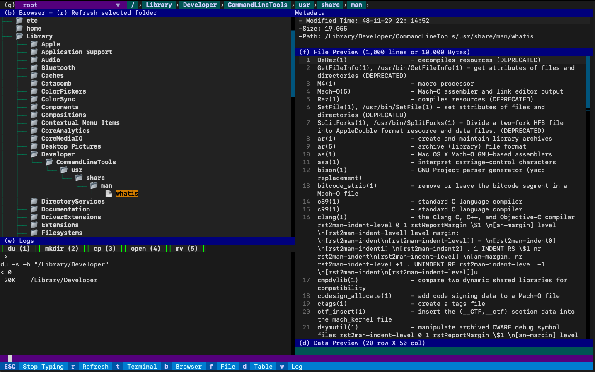

# Terminal(Textual) File Browser
File browser in terminal built with [Textual](https://github.com/Textualize/textual). For personal use.



### Install
```
python -m venv tfb
source ./tfb/bin/activate
python -m pip install -r requirements.txt
```
### Run
```
python app.py
```
### Shortcuts
```
(ctrl+c) Quit
(q) Drive presets select

(r) Refresh selected folder

(:) Start typing command, (escape) Stop typing command
(1 - 9) Paste command presets
(f1) Paste selected path to command
(/) Start searching, (escape) Stop searching

(c) zoom into selected folder
(escape) zoom out to selected's parent folder

(b) File browser window focus
(f) File preview window focus
(d) Data preview window focus
(w) Log window focus
```
